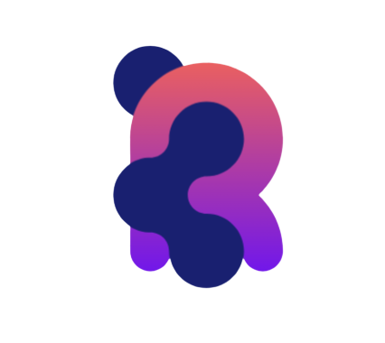
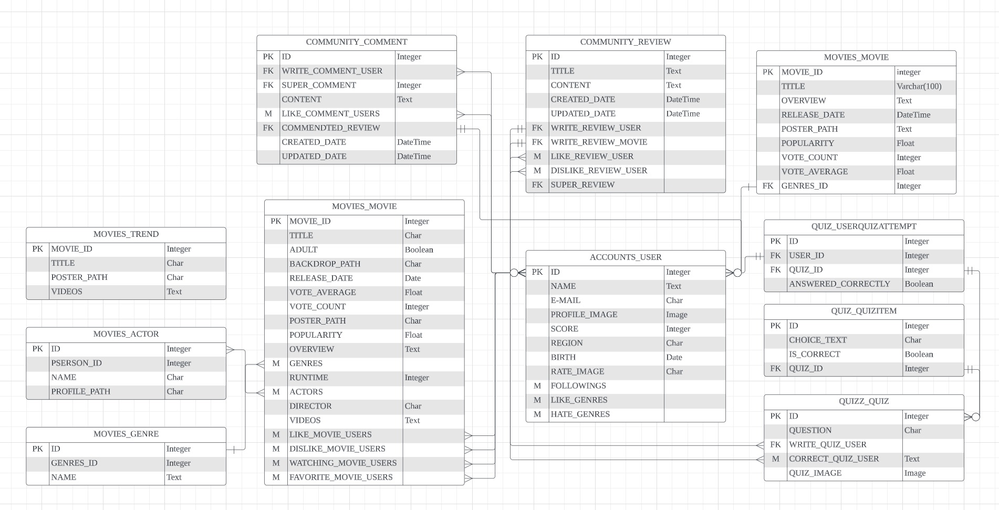

<div align="center">
  <br />
  
  <br />
  <h1>ROU (I Relate tO U)</h1>
  <br />
</div>


## 목차

1. [**웹 서비스 소개**](#1)
1. [**기술 스택**](#2)
1. [**주요 기능**](#3)
1. [**프로젝트 구성도**](#4)
1. [**개발 팀 소개**](#5)
1. [**개발 기간 및 일정**](#6)
1. [**실행 방법**](#7)
1. [**프로젝트 느낀점 후기**](#8)

<br />

<div id="1"></div>

## 💁 웹 서비스 소개

##### ROU 는 영화라는 매개체로 사람과 사람을 이어주는 웹 페이지 입니다.

ROU의 어원은 routing에서 나왔습니다. 라우팅의 뜻은 노드와 노드를 연결하는 최적의 경로입니다. 

저희 ROU 웹 페이지는 사람과 사람(세상)을 연결하는 최적의 경로가 되겠습니다. 

ROU의 속 뜻은 'I relate to u'  : 나는 당신을 이해해, 나는 당신을 공감해. 

저희 사이트는 그저 영화를 추천해주는 사이트에서 더 나아가 영화라는 소재로 당신의 기분과 상태를 이해하고 싶습니다. 그리고 당신이 당신의 세상이 더욱더 넓어질 수 있도록 하는 최적의 경로가 되고 싶습니다.

저희와 같이 많은 사람들을 만나며, 당신의 세상을 넓혀가세요. 

<br />

- 'ROU' 게스트 계정 정보

|  아이디  | test01   |
| :------: | :------- |
| 비밀번호 | 123123!! |

> 서비스를 구경하고 싶으시다면 상단의 계정 정보로 로그인 후 사용하실 수 있습니다.

<br />


[**🔗 프론트엔드 저장소 바로가기 Click !**](https://github.com/ROU-Movie-PJT/ROU_movie_community/tree/main/final-pjt-front) 👈

[**🔗 백엔드(메인 서버) 저장소 바로가기 Click !**](https://github.com/ROU-Movie-PJT/ROU_movie_community/tree/main/final-pjt-back) 👈

[**🔗 ROU notion 바로가기 Click!**](https://www.notion.so/iamyouj/ROU-Relate-To-U-91895f2f11b14786a75d98b062ceb7be) 👈

> 새 창 열기 방법 : CTRL+click (on Windows and Linux) | CMD+click (on MacOS)

<br />

<div id="3"></div>

## 🛠 기술 스택

### **Front-end**

|  |  |  |
| :----------------------------------------------------------: | :----------------------------------------------------------: | :----------------------------------------------------------: |
|                            HTML5                             |                             CSS3                             |                         JavaScripts                          |

|  |  |  |
| :----------------------------------------------------------: | :-------------------------------------------------------: | :----------------------------------------------------------: |
|                          BootStrip                           |                           Axios                           |                             Vue3                             |

### **Back-end**

|  | <img src="data:image/png;base64,iVBORw0KGgoAAAANSUhEUgAAAOEAAADhCAMAAAAJbSJIAAABJlBMVEU4dqz3zQD///8mTW/y8vIlS2z90QAaSXEuX4p5elb70AAwZJErWICFg1AIRHNTZ1vDqjEuUmrnwwsURnIdSGsVRGkAO2OakUIzV3cKQGa3wcsYSGyms8Cbqbg2caXCy9RPbIcAOWLT2uBlfZSMnq8pb6n59/UoU3ellkjd4+iAk6VJaIQ6XXtyhprq7vHM1Nvy9Ptrlb2Ys826ytqyoDd5fU+Pikj13X/x8edEfrFZibamvdOLqsi8zNx4nsE+eq5ib1fgwApda1zLsCdIX2M8WGjZuiFvdVaomT+7pTp/fVdMYmFqhKAGT4CRhi0+apK1tpXX1sLrz1jr4K7p5MTn2Zzo1YXr6tflyD7Nw4ZbdH8APHX20jv211V6iHrlyU305a3gy2j8uYOfAAAOQElEQVR4nN3de3fTyBUAcL1sBSc4iS0Jy3JiR3bsyg+FLAHMq7tZIIFCt93YIbRly+b7f4lKsmXrMZLmjkb20PvHnj1wIPpx7zw0Go04ofCQrHazdTTsdkbjcWMgDhrj8ajTHR61mm1LKv7HcwX+3bbV7k06A03TVVU1FKUk+lFSFMP5NV3TBp1Jr23ZBV5FUUKrOew0dN2BienhUHW90Rk2rYKupAih1eqKqp5pCzt1Vey2ilDSFkrt4UBTIbgAU9UGwzbtpklVaDe7hm4Q6fxw/ny3SbVZ0hP2m11RJ0teJJW62G32qV0XLaE51KnwfKQ+NCldGRWh1Bpp+YozHoY2alFpkhSEVo9OdUbDqdYehc41t9DsqmoBvEWoatfcstDsnBSRvnUoJ52cxlxCs6sV6/OMWjeXMYfQ6hbS/BBGvZujPRILpWHOsR0Shj4k7ldJhS2juP4FFarR2qjwbKRv1OeGPjrbnHBIOLXOF4o63JCwveECXYdqtDcglCbalnxuaBNwjwMVnjW2lcBFqA1oawQKexsaApND0XsFCu0tdKHx0EegO2SIsK1sO4GLUBRIhwMQHuml7J++kSjpR0UIu4QVWvLC/b+BE3t77n8Hq98gNOpd6kJ7DO9DPcFgb2d39/j4mIuE80vHuzuOVyRyqmPcxogpNBvAJuhctmuLy2LhQgdwpdIwaQrboOVdhyc6uExbyLkLVSqYExwsYesEpNsD6vzY3RFByBOs2w0cYQt/nkbOW6bSKVh8ooZDxBAeYXeipUEu3jKTe/iJxBk1soU9XKDjy83z4ngH24gxhcsU9jBLtLSXP30Bo4hp1DKJWULMEi0NKPo84x4mMbNQM4QtTCCl+gwZMfscPaO7SRfi9aLUE7iMHTxiRo+aKmxjjYOlnUJ8TuxiCcWT1KE/TWhiLYgWUaF+HOMRDZNMaGPNRYsE4hKVRso0PEU43j4QmzgmEXZxbpdibfD09MXLly+4U2rEXazuRk2+X0wU4g2Eg6jvtWlLkm29ekHNiNejJg+LScI2FjBSo6fndl/yoi+9okXE7G30pA41QWgrWP9y4RSevl76POMZJSFmnZaUhN4mQTjCuuMNp/D0PAB0iG8oZfEYb+BXRhAh5v1EKTyXsaRQ9P9KiTjAupik+wyk8Az3hil4Hac/9cNCyaIkxJy9iTpywR8llHCXnULN8NSUonG+WaHSQD22QQknuAuHIeGLGLD/E50k4nU1TqgTPGEbe1kmJHwZLVKpT2nEwBaKGmLIQAjxNyCEhOdx4ZNNC0UDRzjEX9xmLoci4kF4THgGWL0PCX+2Y8LXGxeKaqw/jQnxxnqE8PRNNIn2CypAkDA+7keFmAszCCF3XlAzBAnjyzYRoQTa5xSZlj6JJPFnOkCYUDSkVCGgm4kJuVMrSOyf07q7gAmjnU1YaMGegg6i13K2IvZtakCgUNStFGEXthkvJjx9bfW9kJ7QuwWGCo1ustAEPsiOCblT7vzVmzevXlP0gYWibiYKu8AHvXGhi3SDog8uVLpJQhO6nwsppB9QoaiZCcIOdLsMq0KlgxaagGfZbAvFExMphLZChoXBlrgWWvANM8wKRdVCCHv/V8JeXCiB/xaWhaIoxYSgmwr2hetbjJUQcl/4AwjX94m+EDzaMy5cj/q+cEjyAgzLQmMYFvaJNo+yLBT1fkjYJBPuEsTGhM2QED6f8aIED4K8kwn9ec1CaBP5iGJjQlG0A0KyIiWKzQmXZcrlKVKSyCOUUZF46csy9YSwNcR8kUNYevowFg9++WRU6zLyRy3WFT0h3raErQsPa2VkXB48PUQhF5sXuKzhnqC7LKovPazx6KiU+YNfqzHjYtD3hEkPyhevS9CNHONhotBFVt7uV2P14gst5Jw076Z0eoEjdBP5wYikUbOWwhbi3pfapm0KgSfk+fLlfj2EUFtLYXysKIns+PCFfIW/DlWqN164wngC97aNCgW20Enjw3BjXAjjS1AsJZADCR1isFDdBSkuNmUratc2eUCEfOU6QHQnblx0NGQPCBPy/Lt1j+qOiFx0MZ89IFBYuVwn0V3e5wS7ESpS9oDQHJYv1r1Nw3aEoee+JQaBUCFfvl7VqW45wuC0u+h96WQBFVau1sK2Iwys5jM2DvoBFfLlZ35TVHuOcBLoSlmsUQIhz/v3zMbEEa67UjZrlERYflRfdaZc4NZpQ8uf4CDIYc0vzIHASRrrKSQRrlqiJnHrm0NWU0girFwtk6hZ3GqwYDaFJEK+/Ku8HC645mqw2DYkMYiEF4syVZucf4PPbgqJhHxtOSC2uCM/h2yOhW4QCZdTN/WI8++d2JzOeEEkrCzK1Bhyy0UahouUTMjXvDsMpcv5U5ptM1Jih0hYfqd4kxpuVGK9SLk9MqE36JdG3Jj5IvXfXVPeQ4B85cAr07EvZLcn5bgSkZCv1RfCBvPN0H/DUt4vw4heQ2wsSqC4YxEohN+Vyk9hwsWIOOB+mGYo1j8AhYubxEWVstwMV68B199WQMJFV9NY9jTbZqTE6g1SGeTzF6TG3EgUGb41DKQQ3NHwtUPnj428OQ3LHc3qrKHqBaxInXiviKWONy9luKNZv4wPLVKnq9mX3Vkb28L1kRHQscIVPpXdmfdEYbkrXZ8VVb8CF6k7M1Um3NAd+FkVrg/8kq/BKeTLHxzhkHMX9VntSgNHDcjwFPKVj3VR7XnrNIwKA0e21Z/BU+gM+XV3ncZ9xs2kMHhem3IIz6A75NdFvcmZOpuPnEInmZHU6OJpsG5ytsbigB8+VLAKnHP74Qg1m+vr7And82iDwIdkQPceWO9zQoOtAf84dn5p9QEh0BEqDe/5IT3h8e7uzs4eeaBOhq4+JWmDi5C954cTg47Q+ccf5Nx7KiKi+owcyMuq+wz4SKUhjDQdWiHLB6Ql6kRFVo+8vRj5hbu4R8bCQqnvX+YAOkJvL4at5p1470LObwZE9fCikqNEebdK3R1D0jinEPc8XFjI1dIjPk8CebcvHUvuvraukusE7gIKVJHr8v5FXp8r7Ho793pqDiHifRbkex+4Ua/Xq8b76w9X5Xz16cVltbfcX0re00SBcr16uH/9t/ibH7jx7NHF2yu+TMPnzEtPFvtLLXJhGChX6w8uas6dZ67I2bkEhVdVa7nPm1QYAsr1Tx95Kv/2tKJyJS93sk8IhaFDKaufDuj969OJysHnpbBJeG8ReNVGqT7iGfO5j/JfLYX234mAgXFQLr3N3bXTj/Jvtv/e0z9IgIFGWP+Ua3JVVJQfrt7s6pGcCbSu0fqv7FWoG5V/roQkR8etUyi/ZxPI87+vhDaBcJVC5fCSUWBtun4PGH5YbCCFLHYyXtwE3nSGH8O5t2qEJGu1m4lZQAg+03g12CuH23YkxzR4psJLoHBVpNWPzKbwJnRqBLRM/SJV3m3bkRyzkFACClet8BGzKawJISGwN13PuS+3DUmM+4jwDJTE1TYl8P6IzcU8IhRAB8b6wh+gSNdC0Pnp/sNZ6DalDcZtTAiaufk3TnXQntZNRq0fEwqQbzX4QoXZIv0ixIWQec1yOFTeMyucIoSQeY0v/MSq8F5ACQEDxh7rg8UdUghIIuvCrwJaiJ9E1oXzBCF+EhkXfheShNhJZFw4TxRiJ5Ft4b2QLDQxk8i2cJoixJ3YMC38IqQJMWenLAvXM1KkEPMWg2XhrZAuFLC+DcOwMJrCuBDri3cMC+dRUPx7TzidDbvC+5gnLsRZdmNWGKtR5FfJMNZOmRXGahT97bzsb+CwKozXKFpo/6g5RNRowjcsM/tTRoUzFAb9HdKs/pRFYbn2L6Ql4VuyGeM+e8Jy5eLfaEqCMGPhjS1hpVyufXhXh30POGPzQg5hJd+ut/guuAp/9eEXuY76QGeqUEj9OiO5sPLx+gHN+GX/neyedg3/LrcgfE7ZdUouLP+lmmv/aTy8k0tIvq0uCOPBThIyjzB81C+dUMbJjBSh3VDc464HqDc/2BIqjYReJkMomFmH0bMiNKwURZpQaGd8p4wR4Qnye9xYQqGZ/n0dNoQn0W+rQoQZX4EiEv6nCg70pw+WEft4LEwoHKURSUb8qwN4PE0hZgEzhUIvpVCJZm0VcKzO6kTESeJIjy0UeslZ3NC8NEWo9zKvP1uYUqhbFybP1UBCoZVUqNsWalltEFcoNBPGxS0LT5o4F48lFNoG8os8WxWWjNSBHigUzAaKuE2hMjDxLh1TKNhjxIdMtihURymTbSKhIHTjXer2hPoE+7rxhc6oEX2bcmtCnFGCQCi0RYUJoWIkrcnkFQp2R2dAqHdwmyBc6E7hlC0LFUiFEgiFs2CfSlf47flsPp89/5YqVBt4oyC5UJCGWjHCW+mx5MRjaRY1BoTaRMq+xJxCp8NR1QKEd57PM07/SBCqoC6GXOikcdkaKQqnUiAeh4lLoaIPs6+NjtCZxI10usL546BQmiKE+sgkulYyofs1OpWi8CYMlB7fRoWqgXOnRFMo2EPdoCacS5EIJbH8qKr3wD1MbqEgWBONlnAaFYZaYvm3z2lLvsUJneb4XzrCP6JA6fHzwG9//z3PReYSCsL8Kw1htBmGGuJ3xA6SDQoF4e57fmFKDm/usi+hYKFjvM/9blBCO6zd5/ZREQrC9PYyn/AulkRn5vbtdpr9o7ODitCJ+U0e4fPoePgnTyN9XtASCkJ/lqNFhst0Op2hdjeRBT2h4FbrDWGT/Bbk3VGpTj+oCp2Yzsj6nZsF7256Ry97i6AtdOPulmSUnLu8Aq6mCKET/bvZ/VfAh+C+3v85p528ZRQk9GJ6N/vy/Fu6s/bt/sst3YYXiSKFi+hP57PZ7Zebr1eXlzWXW6tdXl59vflyO5vN+wUlLhD/A6jKN7JStpv/AAAAAElFTkSuQmCC" alt="Spring-Boot" width="50px" height="50px" /> |  |  |
| :----------------------------------------------------------: | :----------------------------------------------------------: | :----------------------------------------------------------: | :----------------------------------------------------------: |
|                            django                            |                            Python                            |                        Rest framework                        |                           Postman                            |

<div id="4"></div>

## 💡 주요 기능 및 실제 구현 정도

| 기능                             | 내용                                                         | 구현도 |
| :------------------------------- | :----------------------------------------------------------- | ------ |
| 박스 오피스 인기영화 조회        | TMDB의 데이터에 기반하여, 현재 인기있는 영화를 보여드립니다. | ⭐⭐⭐⭐⭐  |
| 필터링된 영화 정보               | 영화 장르별, 관객수, 최신수, 개봉예정작, 평점수로 영화를 추천합니다. 정렬 기준은 최신에 개봉한 영화이거나, 인기있는 영화를 기준으로 정렬됩니다. | ⭐⭐⭐⭐⭐  |
| 단일 영화 조회                   | 해당 영화의 타이틀, 장르, 포스터, 감독, runtime, actor 등 정보를 제공합니다. | ⭐⭐⭐⭐⭐  |
| 영화별 게시글 조회               | 영화별로 다른 유저들의 review를 알 수 있습니다.              | ⭐⭐⭐⭐⭐  |
| 영화 싫어요, 좋아요, 찜, 시청 중 | 영화에 대한 유저의 영화 싫어요, 좋아요, 찜, 시청 중를 기록할 수 있어요. 또한 각각의 수가 count되어서, 다른 사람들이 좋아요를 몇개나 눌렀는 지 알 수 있어요. | ⭐⭐⭐⭐⭐  |
| Quiz                             | 영화의 명대사를 맞출 수 있습니다. 영화 맞춘 수를 바탕으로 유저에게 등급이 부여됩니다.(추후 서비스 개시 예정) | ⭐⭐     |
| 게시글                           | 게시글 CRUD <br /> 게시글 은 관리자가 적은 공지, 최신순, 좋아요 순, 댓글 많은 순으로 정렬이 됩니다. 그리고 각 게시글마다 댓글 수, 좋아요 수, 싫어요 수가 나옵니다. 관리자가 적은 공지에는 영화 소모임이 나올 예정입니다. | ⭐⭐⭐⭐   |
| USER                             | user singin / login / logout /  following / 선호, 불호 장르 조회, 수정 / 회원 정보 조회, 수정 / 회원 탈퇴 | ⭐⭐⭐⭐⭐  |
| 소셜 로그인                      | 소셜 로그인 기능 구현(추후 예정)                             | 미구현 |
| 카카오 맵 API                    | 카카오 맵 기능 구현(추후 예정)                               | 미구현 |
| 메시지 기능                      | 유저끼리 메시지 기능 주고 받기(추후 예정)                    | 미구현 |

<br />

<div id="5"></div>

## 📂 프로젝트 구성도

|                     개체-관계 모델(ERD)                      |
| :----------------------------------------------------------: |
|  |

<br />

<div id="6"></div>

<div id="7"></div>

<div id="9"></div>

## 👪 개발 팀 소개

<table>
  <tr>
    <td align="center" width="30px">
      <a href="https://github.com/yuj1818" target="_blank">
        
      </a>
    </td>
    <td align="center" width="30px">
      <a href="https://github.com/1ny931228" target="_blank">
        
      </a>
    </td>
  </tr>
  <tr>
    <td align="center">
      <a href="https://github.com/yuj1818" target="_blank">
        손유정<br />(Back-end & Front-end & 팀장)
      </a>
    </td>
    <td align="center">
      <a href="https://github.com/1ny931228" target="_blank">
        황채원<br />(Back-end)
      </a>
    </td>
  </tr>
</table>

<br />

<br />

|  이름  |              역할              | <div align="center">개발 내용</div>                          |
| :----: | :----------------------------: | :----------------------------------------------------------- |
| 황채원 |         Back-end<br />         | &nbsp;&nbsp;<br />- DB 설계<br />- 영화 데이터 수집<br />- 영화 추천 알고리즘 구현<br /> -영화 검색 기능 구현<br />- COMMUNITY 구현<br />- MOVIES 구현<br />- QUIZ 구현<br /> |
| 손유정 | Back-end<br />/<br />Front-end | <br />- DB 설계<br />- ACCOUNTS 구현<br />- 메인 페이지 구현<br />- 로그인 페이지 구현<br/>- 프로필 페이지 구현<br />- 영화 상세 페이지 구현<br/>- 유튜브 API<br />&nbsp;&nbsp;&nbsp;&nbsp; |

<br />

<div id="10"></div>

## 📅 개발 기간

23.11.13. 개발 시작

[**🔗 ROU 개발 일정 바로가기 Click!**](https://www.notion.so/iamyouj/1aa39eb12fc747d684ff2787f964193e?v=e002b5bca1534557b64bffcdea8ffebb&pvs=4) 👈


<br />

<div id='11'></div>

## 💻 실행 방법

### Client 실행

1. **원격 저장소 복제**

```bash
$ git clone https://github.com/ROU-Movie-PJT/ROU_movie_community.git
```

2. **프로젝트 폴더로 이동**

```bash
$ cd final-pjt-back
```

3. **필요한 node_modules 설치**

```bash
$ npm install
```


### Main Server 실행

1. **원격 저장소 복제**

```bash
$ git clone https://github.com/ROU-Movie-PJT/ROU_movie_community.git
```

2. **프로젝터 폴더 이동**

```bash
$ cd final-pjt-back
```

3.  **가상환경 설정**

```bash
$ python -m venv VENV
```

4.  **가상환경 이동 **

```bash
$ source VENV/Scripts/activate
```

5.  **requirements.txt 파일 설치**

```bash
$ pip install -r requirements.txt
```

6. **loaddata 하기 **

```bash
$ python manage.py loadddata end.json
```

6. **runserver**

```bash
$ python manage.py runserver
```


## 💁 프로젝트 느낀점 후기

- 황채원
  - 알고리즘의 중요성을 느꼈습니다. 처음 TMBD의 url를 두개 사용해서 삼중 포문으로 받아왔습니다. 이러니, 1시간에 500개가 받아와졌습니다. 2번째로 비동기로 코드를 구현하였더니, 1시간에 천개가 받아와졌습니다. 마지막에는 테이블에 null와 blank True를 통하여, 각각 url에 정보를 받아왔습니다. 이러니, 1시간 30분만에 모든 정보를 받아왔습니다. DB를 효율적으로 받아오는 것의 중요성을 알게되었고 다음부터는 한번에 모든 정보를 받지 않고 나눠서 받을 코드를 생각해야한다는 것을 알았습니다. <br />
- 손유정
  - API 문서화의 중요성을 느꼈습니다. 어떤 데이터가 받아와지는지 어떤 형식으로 데이터를 보내야 하는지 체계적인 문서화를 통해 확실하게 알 수 있어 프로그램을 구성하는데에 많은 도움이 되었습니다. 또한, 최적화의 필요성을 느낄 수 있었습니다. 많은 데이터를 필요로하는 페이지가 렌더링 될 때마다 데이터를 요청하니 로딩 시간이 많이 걸려 사용자 경험에 지장을 줄 수 있을 것 같았습니다. 캐싱 작업이나 무한 스크롤 기능을 통해 그런 점을 보완할 수 있을 거라 생각합니다.

<br />
